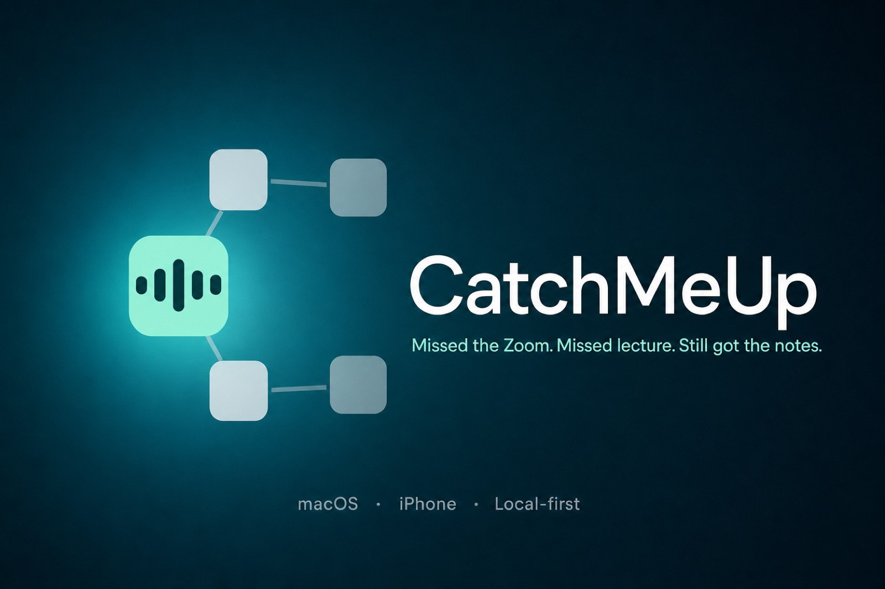
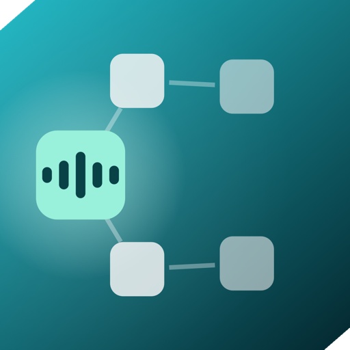

<p align="center">
  
</p>

<p align="center">
  
</p>

<h1 align="center">CatchMeUp</h1>

<p align="center">
  <strong>Missed the Zoom. Missed lecture. Still got the notes.</strong>
</p>

<p align="center">
  A local-first recap engine for people who skip the live session and still have to own what was said.
  Batch a week of recordings on the Mac. Carry the same library on iPhone.
</p>

<p align="center">
  
  
  
  
  
</p>

---

## Why it exists

Live-capture tools assume you were in the room. CatchMeUp assumes you were not.

Drop a Zoom export, a lecture capture, or a folder of OCW videos. Audio is transcribed **on your Mac** with WhisperKit. Notes are written by **your** LLM — Anthropic, OpenAI, Gemini, Groq, or local Ollama. Recaps and brain metadata can be shared with the iPhone through iCloud Drive; copying audio enables playback there. Supporting-material files and study history do not have full cross-device parity.

| You | Drop in | You get |
|---|---|---|
| **Work** | Zoom, Meet, standup, 1:1, client call | TL;DR, decisions, **action items**, timestamped bookmarks |
| **School** | Recorded lecture, seminar, discussion | What you missed, **terms**, lecture notes, **study / exam checklist** |

Same pipeline either way — only the recap style changes:

```
recording  →  ffmpeg (mp3)  →  whisperkit-cli (on-device)  →  your LLM  →  Word + Markdown
```

Long lectures are split on timestamps, recapped in passes, then merged. Transcription is local;
AI features send text to your configured provider unless you use a local model. Optional audio
sync copies recordings to the shared folder, which may upload them through iCloud or another service.

The installed command is `catchup`; `./catchup` runs the same CLI from a source checkout.
The iPhone app is in [`ios/`](ios/README.md).

**Release status:** CLI 0.2.0 is a [GitHub preview release](https://github.com/rsheth8/CatchMeUp/releases/tag/v0.2.0),
not a production-certified Mac installer or a PyPI release. Start with the package or source checkout below.
The bundled Mac executable remains a developer build pending signing/notarization and clean-Mac integration testing.

Examples below use `./catchup` for a checkout; after package installation, use `catchup` instead.

## A workspace for school and work

Start with `./catchup today` for a local overview of courses, work projects, and open follow-ups.
Use `./catchup today --audience student` or `--audience work` to focus the view.

### Students

```bash
./catchup brain new "Biology 101" --lecture
./catchup materials biology-101 add ~/Downloads/week1.pdf
./catchup into biology-101 ~/Downloads/lecture1.m4a
./catchup review biology-101                         # local checklist + key terms
./catchup ask biology-101 "Explain mitochondria" --closed
./catchup exam biology-101 --print
./catchup drill biology-101
```

`review` summarizes the latest three saved recaps without a model call. Existing exams and drills
still use recorded lecture content; document context is available in `ask`, `think`, and `grade`.

### Work and meetings

```bash
./catchup brain new "Product team" --meeting
./catchup materials product-team add ~/Downloads/agenda.pdf ~/Downloads/proposal.pptx
./catchup into product-team ~/Downloads/standup.m4a
./catchup prepare product-team                     # recent recaps, outcomes, open tasks
./catchup tasks product-team                       # IDs + owner/date/status/evidence
./catchup tasks product-team review TASK_ID --owner "Jordan" --due 2026-10-01
./catchup tasks product-team start TASK_ID
./catchup tasks product-team done TASK_ID
./catchup tasks product-team --all --json           # includes completed follow-ups
```

Replace `TASK_ID` with the displayed eight-character ID. `open` reopens a task;
`edit ID --owner NAME --due YYYY-MM-DD` changes details, and `--due none` clears a date.
Legacy action items are unreviewed suggestions: owners and calendar dates are not guessed.
`review` explicitly confirms a task; completing one does not silently mark it reviewed.
Phone-created meeting agendas, outcomes, evidence, and reminder links survive sync and CLI edits.
`prepare` shows existing outcomes; it does not invent or extract new decisions. Nothing here sends
emails, creates calendar events, or exports reminders automatically.

### Supporting materials

```bash
./catchup materials product-team                   # list IDs
./catchup materials product-team show MATERIAL_ID
./catchup materials product-team search pricing
./catchup materials product-team add proposal.pdf --recap "Billing sync"
```

Both course and meeting brains accept **PDF, PPTX, UTF-8 TXT, and Markdown**. `--recap` must match
one recap title or folder ID; otherwise import refuses to guess. Reimporting the same contents
does not create another copy. Originals and a page/slide/line-addressed text index live under
`brains/NAME/materials/`. Sources are searchable immediately, even before the first recording.
Q&A citations distinguish these documents from things actually said in recordings.

This is text extraction, not full visual understanding: scanned pages need OCR first; diagrams,
charts, handwriting, slide speaker notes, and animations are not interpreted. Image-only imports
are rejected with guidance; partially readable files show a warning. Limits are 50 MB per file,
300 PDF pages/slides, and two million extracted characters. Export Keynote or older PowerPoint
formats to PDF/PPTX first. Update the Python package to install the PDF dependency on an existing install.

**Privacy and sync:** Import, material search, `today`, `prepare`, `review`, and task edits work
locally without iCloud or an API key. AI commands may send retrieved text to your configured model
provider; choose your existing local-provider setup if the text must stay on-device. Materials
do **not** yet sync to iPhone and do not retroactively regenerate recaps, exams, or the concept graph.
Task edits are saved locally; use `./catchup sync pull` before editing and `./catchup sync push`
afterwards if sharing with the phone. Sync keeps the newest whole recording, not per-field merges;
avoid editing the same meeting independently on both devices. Back up your local data folder.

Use `./catchup help materials`, `help tasks`, or `help today` for command options.

---

## Two surfaces, one library

<p align="center">
  
</p>

| | **Mac CLI** | **iPhone** |
|---|---|---|
| For | A week of files, folders, watch folders | Record in class, replay on the train |
| Transcribe | WhisperKit (on-device) | Apple Speech (on-device) |
| Recap | Your cloud LLM or Ollama | Demo / your key / Apple on-device |
| Organize | `today`, `review`, `prepare`, `tasks`, `materials` | Materials, meeting workspace, follow-ups |
| Explore | `ask`, `exam`, `clip`, `think`, `cortex`, `sync` | Exam, Clip, Ask, player, iCloud |

**iPhone showcase:** In Settings, select **Demo** or **Explore the showcase account**
to try a separate, populated student/work library without an API key. It includes 12
narrated recaps, playable moments, four brains, documents, meeting follow-ups, and a
sample study history. Demo chat matches local sources; it is not live AI generation.
Your personal library and provider settings stay separate. [Showcase details](ios/README.md#show-the-app-without-an-api-key).

```bash
./catchup lecture ~/Downloads/week3.mp4
./catchup sync push         # send recaps to the shared folder
```

On the phone: **Settings ▸ Sync**, same Apple Account. Recaps auto-push after a CLI run once that iCloud folder exists. `CATCHMEUP_SYNC=0` opts out.

---

## Install the CLI

The CLI now has one Python entry point for source installs, packages, and bundled
executables. No running backend is required. **Do not share your `.env`** — it contains your API key.

### Development checkout

```bash
git clone https://github.com/rsheth8/CatchMeUp.git
cd CatchMeUp
python3 -m venv venv
./venv/bin/python3 -m pip install -e .
./catchup setup
```

Python 3.10+ is required for source/package installs. Plain `setup` creates the local
library without installing software or asking for a key. On a Mac with [Homebrew](https://brew.sh),
use `./catchup setup --install-audio` to explicitly install missing audio tools:

| Package | What it does |
|---|---|
| **ffmpeg** | Turns `.mov` / `.mp4` / `.m4a` / … into an `.mp3` WhisperKit can read |
| **whisperkit-cli** | On-device transcription with timestamps |

Then pick a provider and a default style:

```bash
./catchup providers
./catchup config anthropic       # paste a Claude / OpenAI / Gemini / … key
# or stay local, no cloud key:
#   ./catchup config ollama
#   ollama pull qwen3.6:35b
./catchup mode meeting           # work
./catchup mode lecture           # school
./catchup doctor
```

`doctor` checks configuration and installed capabilities without a network request;
it does not prove microphone permission, model availability, or API connectivity.
Local tasks and material workflows work without audio tools or an API key.

### Installable package and Mac executable

Download `catchmeup-0.2.0-py3-none-any.whl` and `SHA256SUMS` from the
[GitHub preview release](https://github.com/rsheth8/CatchMeUp/releases/tag/v0.2.0).
Verify the downloaded file's SHA-256 against its entry in `SHA256SUMS`, then install
the wheel using [pipx](https://packaging.python.org/en/latest/guides/installing-stand-alone-command-line-tools/)
(install pipx first if needed):

```sh
pipx install /absolute/path/to/catchmeup-0.2.0-py3-none-any.whl
catchup --version
catchup setup
catchup today
```

This installs the downloaded package; version 0.2.0 is not published on PyPI.
An executable build recipe and CI candidate artifacts are included too. They bundle
Python, but not FFmpeg, WhisperKit, or model weights. A signed/notarized public Mac
release, Homebrew tap, and installer are still release work, not available downloads.
Developers can build their own wheel with `venv/bin/python3 -m pip install -e '.[build]'`
followed by `venv/bin/python3 -m build`.
See [CLI distribution and release gates](docs/CLI_DISTRIBUTION.md).

Installed builds default to `~/Library/Application Support/CatchMeUp` on Mac;
source checkouts continue using their existing library. To use your current data
with an installed build, set `CATCHMEUP_HOME` to your checkout's absolute path or use:

```sh
catchup --home /absolute/path/to/existing/CatchMeUp today
```

Nothing moves or copies your library automatically. Application upgrades do not
replace this data directory. Input filenames are relative to your current folder.

### Updating an existing install

After saving any local code changes, update the project and its Python dependencies:

```bash
git pull --ff-only
./venv/bin/python3 -m pip install -e .
./catchup today
```

This updates the source install and its dependencies without rerunning audio setup.
For a pipx installation, install an approved newer wheel with `pipx install --force /path/to/new.whl`.
The local workspace commands do not need an API key; transcription and AI commands
still require their respective tools/provider configuration.

---

## Everyday use

**One call, right now**

```bash
./catchup meeting ~/Desktop/standup.mov
./catchup open
```

**One lecture, right now**

```bash
./catchup lecture ~/Downloads/cs61a-week3.mp4
./catchup open
```

**Drop-box for the week** (leave it running)

```bash
./catchup watch lecture
./catchup drop ~/Downloads/week4-os.m4a
```

If the filename already says `lecture`, `class`, `week`, `zoom`, `standup`, `1-1`, CatchMeUp can guess. Passing `meeting` or `lecture` always wins.

---

## Brains — named agents over what you missed

Generic RAG over “all my PDFs” is everywhere. CatchMeUp’s wedge is a **named specialist** bound to a folder of recaps you actually skipped:

| Brain folder | Agent | You ask |
|---|---|---|
| `brains/cs61a/` | Course TA | “Explain environment diagrams from week 3” |
| `brains/acme-client/` | Account memory | “What did we promise them about billing?” |
| `brains/standups/` | Team historian | “Who owns the auth migration?” |

Each brain has a persona, an inbox, and its own recaps and supporting materials. Brain-scoped
Q&A searches only that brain's sources. Ask from the terminal or the iOS app; supporting
material files currently stay on the device where you import them.

```bash
./catchup brain new cs61a --lecture
./catchup brain persona cs61a You are a CS 61A TA. Prefer SICP vocabulary.
./catchup into cs61a ~/Downloads/week3.mp4
./catchup into mit-60001 MIT-6.0001/    # whole folder; originals stay put
./catchup ask cs61a what is a binary heap?
./catchup think cs61a explain mutexes for the midterm
./catchup exam cs61a
./catchup clip cs61a mutex
./catchup rec lecture          # mic → recap (Ctrl-C to stop)
./catchup diff cs61a
./catchup cortex cs61a
./catchup watch cs61a          # brains/cs61a/inbox/
```

**`think`** is four passes, not one chatbot call: decompose → fire related concepts in that brain’s cortex → gather cited claims → critique gaps → synthesize. Inspect the graph with `./catchup cortex cs61a`.

Meetings get **speaker labels** (WhisperKit diarization) so action items can say `Speaker 1 / Jordan`. Lectures skip diarization unless you set `CATCHMEUP_DIARIZE=1`.

Each recap also writes Markdown and Word into `output/`. Stay in CatchMeUp — you do not need a second notes app:

```bash
./catchup notes cs61a
./catchup walk cs61a mutex
./catchup graph cs61a          # opens a clickable graph in the browser
```

Obsidian is optional: `./catchup obsidian cs61a` dumps a vault if you already live there.

---

## What the notes look like

**Meeting** (`*_meeting_notes.docx`)

- TL;DR
- Action items & follow-ups (owners / deadlines when they were said)
- Timestamped bookmarks
- Detailed notes

**Lecture** (`*_lecture_notes.docx`)

- What you missed
- Key moments (definitions, worked examples, “this will be on the exam”)
- Lecture notes by topic
- Terms & definitions
- Study / exam checklist

---

## Commands

Run `./catchup` or `./catchup help` for the full list.  
`./catchup help exam` (or `rec`, `brain`, `clip`, …) prints a short page for that command.
`catchup brain new --help` and `catchup help brain new` work too.

For scripts, put global options before the command: `catchup --no-input --home DIR COMMAND`.
Use explicit scopes such as `catchup search --brain biology-101 mitochondria`.
`library`, `search`, `todos`, `diff`, `tasks`, `brain list/new/show`, `status`, `list`,
`providers`, and `doctor` support `--json`. Other commands reject that option.
Exit statuses are 0 (success), 1 (operation failed), 2 (invalid arguments), and
130 (cancelled). `--version` identifies the build; `--debug` enables tracebacks.
Unknown options are rejected. `--no-input` avoids prompts; exams need `--print`,
and unattended recording needs `--seconds N`. API keys are hidden at the prompt;
automation can use provider environment variables or `config PROVIDER --key-stdin`.

<details>
<summary><strong>Setup & config</strong></summary>

| Command | What it does |
|---|---|
| `./catchup setup` | Initialize the local library; no downloads or API key required |
| `./catchup setup --install-audio` | Install missing Mac audio tools through Homebrew |
| `./catchup doctor` | Check ffmpeg, whisperkit-cli, API key, folders |
| `./catchup config` | Pick a company and paste its API key |
| `./catchup config openai` | Same, skipping the menu |
| `./catchup providers` | List Anthropic, OpenAI, Gemini, Groq, OpenRouter, … |
| `./catchup model MODEL` | Override the default model for that company |
| `./catchup mode meeting\|lecture` | Set the default recap style |

</details>

<details>
<summary><strong>Recap</strong></summary>

| Command | What it does |
|---|---|
| `./catchup meeting FILE` | Recap a **work** recording |
| `./catchup lecture FILE` | Recap a **class** recording |
| `./catchup drop FILE` | Copy a file into `recordings/` |
| `./catchup watch meeting` | Auto-recap new files as meetings |
| `./catchup watch lecture` | Auto-recap new files as lectures |
| `./catchup rec` | Record from the mic, then recap |
| `./catchup install-watch meeting\|lecture` | Background watcher (launchd) |

</details>

<details>
<summary><strong>Brains, exam, clip</strong></summary>

| Command | What it does |
|---|---|
| `./catchup brain new NAME --lecture\|--meeting` | Create a specialist agent folder |
| `./catchup into NAME FILE` | Recap a recording **into that brain** |
| `./catchup ask NAME QUESTION` | RAG over that brain only |
| `./catchup think NAME TASK` | Deep multi-pass analysis |
| `./catchup exam NAME` | Practice exam from that brain |
| `./catchup clip NAME WORDS` | Play ~25s of that concept |
| `./catchup diff NAME` | What changed since the previous recap |
| `./catchup cortex NAME` | Show that brain's concept graph |

</details>

<details>
<summary><strong>Student & work workspace</strong></summary>

| Command | What it does |
|---|---|
| `./catchup today --audience student\|work` | Focus the local workspace overview |
| `./catchup review NAME` | Review recent lecture summaries, terms, and study prompts |
| `./catchup prepare NAME` | Prepare from saved meetings, outcomes, and open follow-ups |
| `./catchup tasks NAME` | Show open follow-ups with IDs and review status |
| `./catchup tasks NAME review ID --owner NAME --due YYYY-MM-DD` | Confirm a follow-up and its details |
| `./catchup tasks NAME start\|done\|open ID` | Track progress or reopen a task |
| `./catchup tasks NAME --all --json` | Export task data to standard output |
| `./catchup materials NAME add FILE` | Import a PDF, PPTX, TXT, or Markdown file locally |
| `./catchup materials NAME add FILE --recap TITLE` | Attach material to one matching recap |
| `./catchup materials NAME` | List the brain's supporting materials |
| `./catchup materials NAME show ID` | Read extracted text with source locations |
| `./catchup materials NAME search WORDS` | Search material text without a model call |

</details>

<details>
<summary><strong>Library & Mac ↔ iPhone</strong></summary>

| Command | What it does |
|---|---|
| `./catchup search WORDS` | Find a topic across meetings + lectures |
| `./catchup ask QUESTION` | Ask your library |
| `./catchup quiz` | Flashcards from lecture terms |
| `./catchup todos` | Open follow-ups from all meetings, respecting saved completion |
| `./catchup moments` | Timestamps from the latest recap |
| `./catchup play HH:MM:SS` | Play 25s of that moment |
| `./catchup sync` | What the Mac and the iPhone each hold |
| `./catchup sync push` | Send recaps to the iPhone (`--with-audio` for playback) |
| `./catchup sync pull` | File iPhone recordings into CLI brains |

</details>

---

## Mac + iPhone

The CLI is the batch engine. The iOS app is the pocket surface. They share a library through the app’s iCloud Drive folder — no extra account.

1. On the iPhone: **Settings ▸ Sync** on, signed into the same Apple Account as this Mac.
2. Recap as usual. When the iCloud folder already exists, CatchMeUp pushes notes to the phone by itself.
3. Record on the phone, then `./catchup sync pull` so exam / clip / think see it too.

```bash
./catchup sync
./catchup sync push
./catchup sync push --with-audio
./catchup sync pull
```

For a CLI export or a shared-folder workflow (for example, Dropbox or a USB stick):

```bash
CATCHMEUP_SYNC_DIR=~/Dropbox/CatchMeUp ./catchup sync push
```

That override selects a CLI destination; it does not configure the iPhone app to
read Dropbox or a USB stick. The app's automatic sync uses its iCloud container.
You can use all local CLI workflows without iCloud. The Simulator helper
`ios/tools/load_cli_data.py` is only for development.

Build the app: see [`ios/README.md`](ios/README.md).

```bash
cd ios
brew install xcodegen   # once
xcodegen generate
open CatchMeUp.xcodeproj
```

---

## Privacy

- **Audio stays on the device** for transcription (WhisperKit on Mac, Apple Speech on iPhone).
- The **text transcript and relevant supporting text** can be sent to whichever LLM you configured. A local Ollama configuration keeps model requests on your machine.
- Audio sync is optional: `sync push --with-audio` copies recordings to the shared folder. Automatic audio push is controlled by `CATCHMEUP_SYNC_AUDIO`; `CATCHMEUP_SYNC=0` disables automatic sync.
- `.env` is gitignored. Don’t zip it, don’t Slack it, don’t commit it.

---

## LLM providers

```bash
./catchup providers
./catchup config gemini
./catchup model gemini-2.5-flash
```

| id | Company |
|---|---|
| `anthropic` | Anthropic Claude |
| `openai` | OpenAI GPT |
| `gemini` | Google Gemini |
| `groq` | Groq |
| `openrouter` | OpenRouter (one key, many models) |
| `deepseek` | DeepSeek |
| `mistral` | Mistral |
| `together` | Together AI |
| `xai` | xAI Grok |
| `ollama` | Ollama on your machine (no cloud key). Default: `qwen3.6:35b` |
| `custom` | Any OpenAI-compatible base URL |

```bash
./catchup config custom --base-url https://your-gateway.example/v1
```

---

## Folders

```
./catchup         CLI
catchmeup/        Python package
recordings/       drop files here
output/           finished Word notes
processed/        originals + mp3 + transcript, archived per run
brains/           specialist agents (gitignored except README)
brains/NAME/materials/  local originals + page/slide/line text indexes
ios/              SwiftUI app
docs/             logo + README art
logs/             pipeline.log
.env              your API key + default mode — never commit this
```

The tree above describes a source checkout. Installed code is separate from user data:
Mac package/bundle installs default to `~/Library/Application Support/CatchMeUp`.
Source checkouts retain the repo-local library. `CATCHMEUP_HOME` or `--home DIR`
overrides the data location; `catchup status` shows the selected directory.

Supported media: `.mov` `.mp4` `.m4a` `.mp3` `.wav` `.aac` `.mkv` `.webm`

---

## If something fails

| Symptom | Fix |
|---|---|
| `ffmpeg not found` | `brew install ffmpeg` then `./catchup doctor` |
| `whisperkit-cli not found` | `brew install whisperkit-cli` then `./catchup doctor` |
| `ANTHROPIC_API_KEY not set` / no API key | `./catchup config anthropic` or `./catchup config ollama` |
| Notes feel like a meeting but it was class | `./catchup lecture FILE` (or `./catchup mode lecture`) |
| Notes feel like a lecture but it was work | `./catchup meeting FILE` |
| File sits in `recordings/` | Size must be stable (still copying). Then `./catchup status` |
| PDF support needs an update | `./venv/bin/python3 -m pip install -e .` |
| Material has no readable text | Run OCR or export a text-based PDF; image-only content is not indexed |
| Material is not appearing on iPhone | Material-file sync is not implemented yet; import it on that device |

Full traceback lives in `logs/pipeline.log`.
For command-interface failures, use `catchup --debug COMMAND` when investigating;
review debug output for private data before sharing it.

---

## Tests

Recaps, brains, and cortex honor `CATCHMEUP_HOME`, so the suite uses a temp directory and never writes into your real library.

```bash
./venv/bin/python3 -m unittest discover -s tests -v
```

That covers brains, cortex, chunking, search, the graph, CLI workflows, material extraction,
follow-up edits, and meeting sync round trips/conflict handling. AI responses are mocked;
the suite does **not** call WhisperKit or a live LLM. If ffmpeg is installed, a smoke test
uses it to convert a short generated tone. All test data stays in temporary directories.
The CLI contract suite also checks every command's help, strict argument rejection,
caller-relative paths, JSON output, safe config edits, and data-directory isolation.
CI additionally installs a wheel into a clean environment and tests a bundled Mac
executable outside the checkout. See the distribution guide for local build checks.

iOS unit tests:

```bash
cd ios && xcodegen generate
xcodebuild -project CatchMeUp.xcodeproj -scheme CatchMeUp \
  -destination 'platform=iOS Simulator,name=iPhone 17 Pro' test
```

---

<p align="center">
  
</p>

<p align="center">
  <sub>MIT License · Audio on-device · Your key, your model</sub>
</p>

## Contributing

PRs and issues welcome. How to run tests, env vars, and the expected layout: [CONTRIBUTING.md](CONTRIBUTING.md).

Don't commit `.env`, API keys, or personal recordings.

